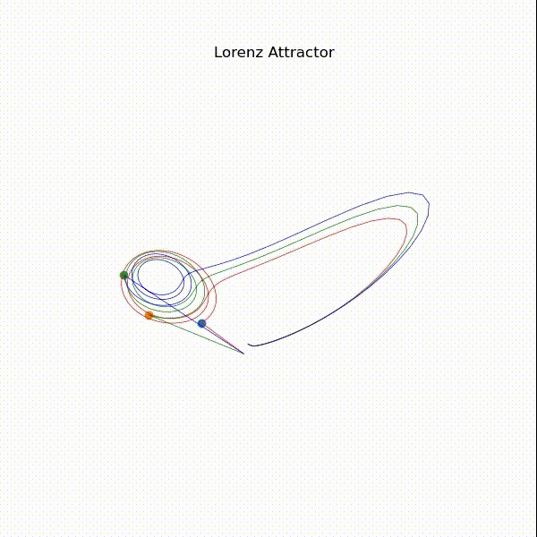
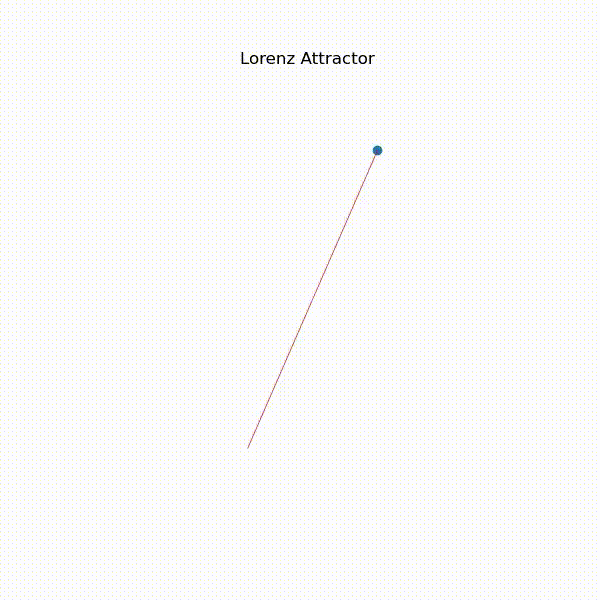

# Lorenz Attractor Visualization

## What is the Lorenz Attractor?

The **Lorenz Attractor** is a set of chaotic solutions to the Lorenz system, a system of differential equations originally developed by Edward Lorenz while studying atmospheric convection. It is one of the first discovered examples of deterministic chaos, meaning that small differences in initial conditions can lead to vastly different outcomes, a phenomenon popularly known as the **butterfly effect**.

Mathematically, the Lorenz system is defined by the following differential equations:

The Lorenz system is defined as:

- $ \\frac{dx}{dt} = \\sigma (y - x) $
- $ \\frac{dy}{dt} = x (\\rho - z) - y $
- $ \\frac{dz}{dt} = xy - \\beta z $


Where:
- **$\\sigma$** is the Prandtl number,
- **$\\rho$** is the Rayleigh number,
- **$\\beta$** is a geometric factor.

## About This Project

This project visualizes the Lorenz attractor using Python. The script numerically solves the Lorenz system and generates a 3D plot of its trajectory. The final output is an animated GIF that shows the development of the attractor over time.

## Installation and Running

1. **Clone the repository:**

```bash
git clone https://github.com/Batuminien/Simple-Lorentz-Attractor.git
cd simple-lorenz-attractor
```

2. **Install dependencies:**

Make sure you have Python 3 installed. Then, install the required libraries:

```bash
pip install matplotlib numpy numba pillow
```

3. **Run the script:**

```bash
python simple_lorenz_attractor.py
```

This will generate an `animated.gif` file in the project directory.

## Code Explanation

- **Initialization:**
  ```python
  num_steps = 5000
  dt = 0.02
  dif = np.empty((num_steps + 1, 3))
  dif[0] = [3., 2., 0.]
  ```
  Here, we define the number of steps for the simulation and the time increment `dt`. The initial conditions for \( x \), \( y \), and \( z \) are set.

- **Lorenz System Function:**
  ```python
  @njit
  def strange_attractors(sigma, beta, rho, xyz):
      dx = sigma * (xyz[1] - xyz[0])
      dy = xyz[0] * (rho - xyz[2]) - xyz[1]
      dz = (xyz[0] * xyz[1]) - (beta * xyz[2])
      return np.array([dx, dy, dz])
  ```
  This function calculates the derivatives based on the Lorenz equations. The `@njit` decorator from **Numba** is used to speed up computations.

- **Numerical Integration and Plotting:**
  ```python
  for i in range(num_steps):
      ax = plt.figure(figsize=(6,6)).add_subplot(projection="3d")
      ax.set_axis_off()
      ax.set_title("Lorenz Attractor")
      ax.plot(dif[i][0], dif[i][1], dif[i][2], "o")
      ax.plot(*dif.T, color="red", lw=0.5)

      dif[i+1] = dif[i] + strange_attractors(sigma=2, beta=(8/3), rho=13, xyz=dif[i]) * dt

      buf = BytesIO()
      plt.savefig(buf)
      buf.seek(0)
      im = Image.open(buf)
      imlist.append(im)

  imlist[0].save('animated.gif', save_all=True, append_images=imlist[1:])
  ```
  The system is solved using the Euler method. For each time step, the new state is computed and plotted. All frames are saved into an animated GIF.

## Sample Output

Here is a sample visualization of the Lorenz Attractor generated by this script:




## License

This project is licensed under the MIT License.

---

Feel free to contribute or open issues if you encounter any problems!

